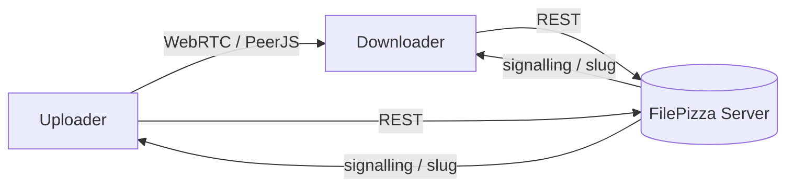
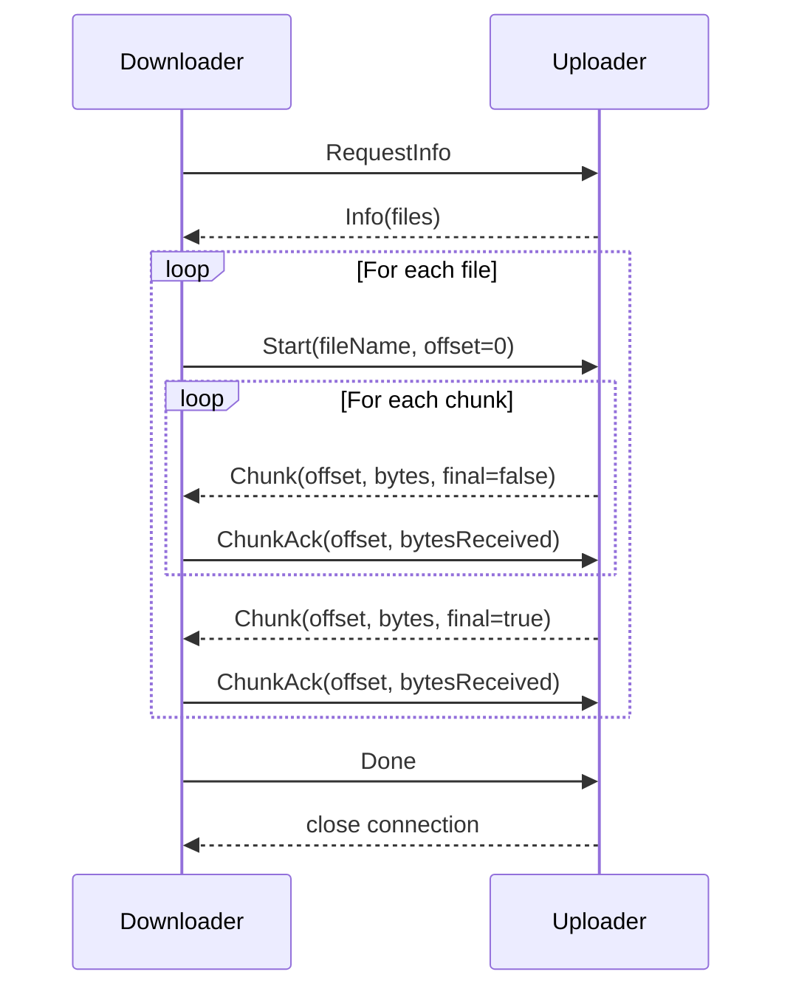
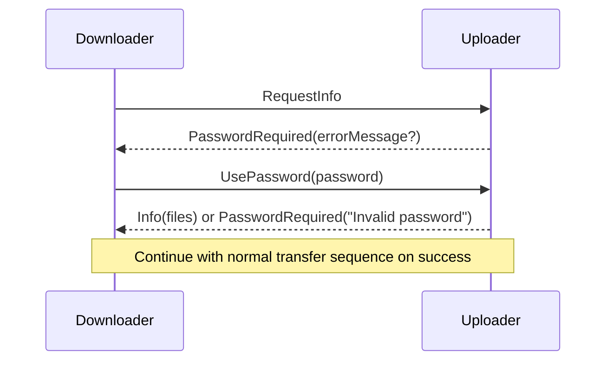
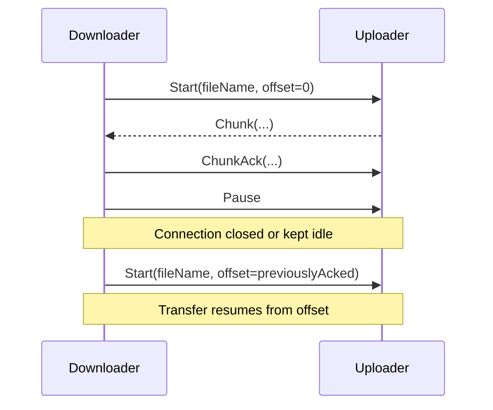
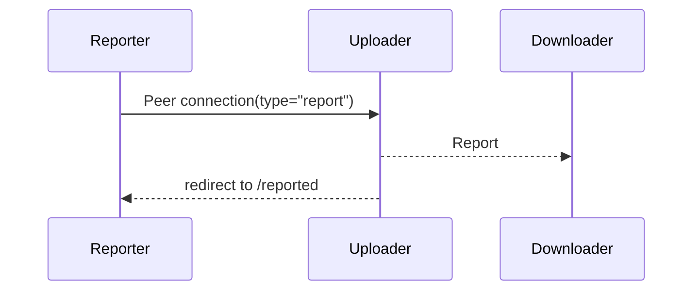

# FilePizza File Transfer Protocol

This document explains the message-based protocol that FilePizza uses to
transfer files directly between browsers over a WebRTC data channel.  It
covers the complete conversation required to build either an uploader or a
downloader and includes examples for common scenarios.

## Architecture Overview



1. The uploader creates a channel with the server and receives a slug that
   encodes its PeerJS identifier.
2. The downloader resolves the slug via the server to obtain the uploader's
   PeerJS identifier.
3. All subsequent messages travel directly between peers over a reliable
   WebRTC data channel.

## Message Types

Every message is a JSON object with a `type` field that matches one of the
values in the table below.  Fields marked with `?` are optional.

```mermaid
classDiagram
    class RequestInfo {
        +"RequestInfo" type
        +string browserName
        +string browserVersion
        +string osName
        +string osVersion
        +string mobileVendor
        +string mobileModel
    }
    class Info {
        +"Info" type
        +FileInfo[] files
    }
    class FileInfo {
        +string fileName
        +number size
        +string type
    }
    class Start {
        +"Start" type
        +string fileName
        +number offset
    }
    class Chunk {
        +"Chunk" type
        +string fileName
        +number offset
        +ArrayBuffer bytes
        +boolean final
    }
    class ChunkAck {
        +"ChunkAck" type
        +string fileName
        +number offset
        +number bytesReceived
    }
    class Pause {
        +"Pause" type
    }
    class Done {
        +"Done" type
    }
    class Error {
        +"Error" type
        +string error
    }
    class PasswordRequired {
        +"PasswordRequired" type
        +string errorMessage?
    }
    class UsePassword {
        +"UsePassword" type
        +string password
    }
    class Report {
        +"Report" type
    }
```



Chunks are sent in pieces of at most 256 KiB (`MAX_CHUNK_SIZE`). The `final` flag in a `Chunk` message marks the last piece of a file.

## Normal Transfer Sequence

The following diagram shows the exchange for downloading multiple files
without a password.



## Password‑Protected Transfers

If the uploader specified a password when creating the channel, the
conversation includes an authentication step.



## Pause and Resume

A downloader may pause an in‑progress transfer.  To resume, it reconnects and
requests the remainder of the file starting at the last acknowledged offset.



## Reporting

A special PeerJS connection with metadata `{ type: "report" }` causes the
uploader to broadcast a `Report` message to all connected downloaders and to
redirect its own UI to a reported page.  Downloaders receiving this message
should abort the transfer.



## Example Conversations

### Single file without password

```
RequestInfo
Info [{ fileName: "photo.jpg", size: 1048576, type: "image/jpeg" }]
Start { fileName: "photo.jpg", offset: 0 }
Chunk { offset: 0, bytes: <256 KB>, final: false }
ChunkAck { offset: 0, bytesReceived: 262144 }
...
Chunk { offset: 1048576, bytes: <0>, final: true }
ChunkAck { offset: 1048576, bytesReceived: 0 }
Done
```

### Password‑protected download

```
RequestInfo
PasswordRequired
UsePassword { password: "secret" }
Info [...]
...
```

### Resuming after interruption

```
RequestInfo
Info [...]
Start { fileName: "video.mp4", offset: 0 }
Chunk/ChunkAck exchanges...
<connection drops after 1 MB>
Start { fileName: "video.mp4", offset: 1048576 }
Chunk/ChunkAck exchanges...
Done
```

---

With these message definitions and sequences you can implement a compatible
uploader or downloader for FilePizza or adapt the protocol for other
applications.
